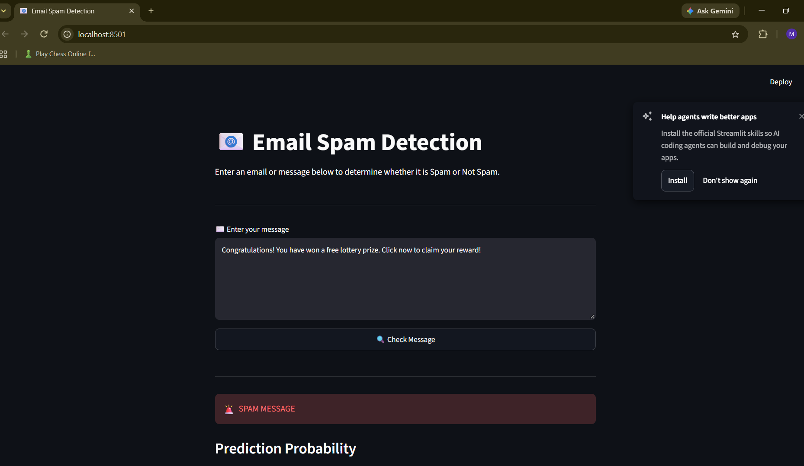
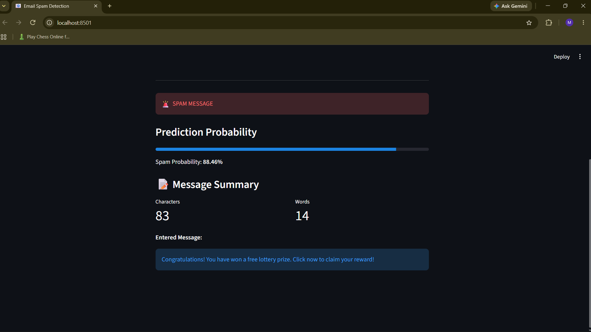
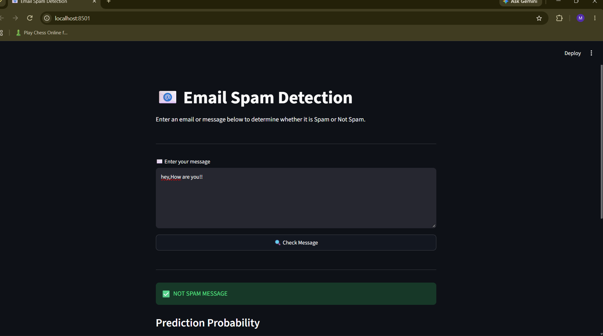
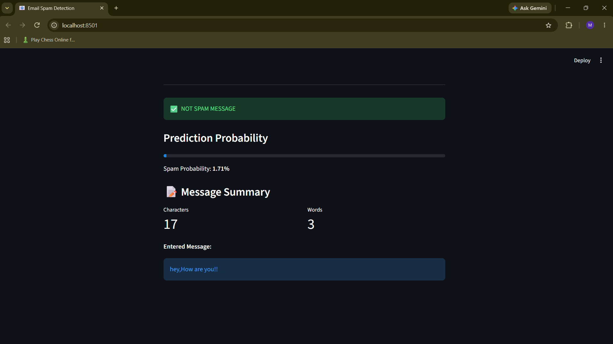
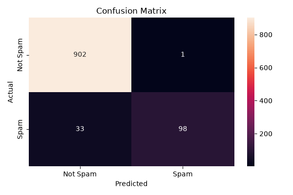

# 📧 Email Spam Detection

A Machine Learning project that classifies an email or message as **Spam** or **Not Spam** using Natural Language Processing (NLP).

## 🎯 Objective

The objective of this project is to build an end-to-end Machine Learning system that can detect whether a given message is spam.

## 🛠️ Technologies Used

- Python
- Pandas
- NumPy
- Scikit-learn
- TF-IDF
- Logistic Regression
- Joblib
- Streamlit
- Matplotlib
- Seaborn

## 📊 Dataset

The project uses the **SMS Spam Collection** dataset.

The dataset contains two main columns:

- `label` — Spam or Ham (Not Spam)
- `message` — Text message

After removing unnecessary columns and duplicate messages:

- Total messages: **5,169**
- Not Spam: **4,516**
- Spam: **653**

## 🔄 Machine Learning Workflow

```text
Dataset
   ↓
Data Cleaning
   ↓
Train/Test Split
   ↓
TF-IDF Vectorization
   ↓
Logistic Regression
   ↓
Model Evaluation
   ↓
Save Model & Vectorizer
   ↓
Streamlit UI
   ↓
Spam / Not Spam Prediction
```

## 🤖 Model

The project uses **Logistic Regression** for classification.

TF-IDF (Term Frequency-Inverse Document Frequency) is used to convert text messages into numerical features that can be processed by the Machine Learning model.

## 📈 Model Evaluation

The model was evaluated using the following metrics:

| Metric | Score |
|---|---:|
| Accuracy | 96.71% |
| Precision | 98.99% |
| Recall | 74.81% |
| F1 Score | 85.22% |
| ROC-AUC | 98.92% |

### Confusion Matrix

The confusion matrix shows how many messages were correctly and incorrectly classified.

The model correctly classified:

- 902 Not Spam messages
- 98 Spam messages

It incorrectly classified:

- 1 Not Spam message as Spam
- 33 Spam messages as Not Spam

## 💻 Streamlit Application

The Streamlit application allows the user to:

1. Enter an email or message.
2. Check whether it is Spam or Not Spam.
3. View the Spam probability.
4. View the message summary, including character and word count.

## ## 📸 Screenshots

### Spam Prediction





### Not Spam Prediction





### Confusion Matrix


## 📁 Project Structure

```text
email_spam_detect/
│
├── dataset/
│   └── spam.csv
│
├── model/
│   ├── spam_model.pkl
│   └── tfidf_vectorizer.pkl
│
├── screenshots/
│   ├── spam_prediction.png
│   ├── not_spam_prediction.png
│   └── confusion_matrix.png
│
├── train_model.py
├── app.py
├── requirements.txt
└── README.md
```

## ▶️ How to Run

### 1. Clone the repository

```bash
git clone <YOUR_GITHUB_REPOSITORY_URL>
```

### 2. Open the project folder

```bash
cd email_spam_detect
```

### 3. Install required libraries

```bash
pip install -r requirements.txt
```

### 4. Run the Streamlit application

```bash
streamlit run app.py
```

The application will open in your browser.

## ⚠️ Limitations

- The model is trained on a specific SMS spam dataset.
- Some new or unusual spam messages may be incorrectly classified.
- The model may not perform equally well on every type of email.
- The current model uses only text-based features.

## 🚀 Future Improvements

- Use a larger email dataset.
- Add features such as number of links and special characters.
- Try other Machine Learning models.
- Improve text preprocessing.
- Deploy the Streamlit application online.